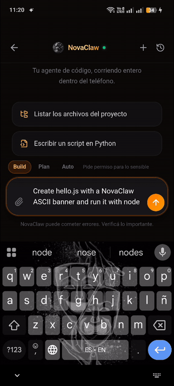
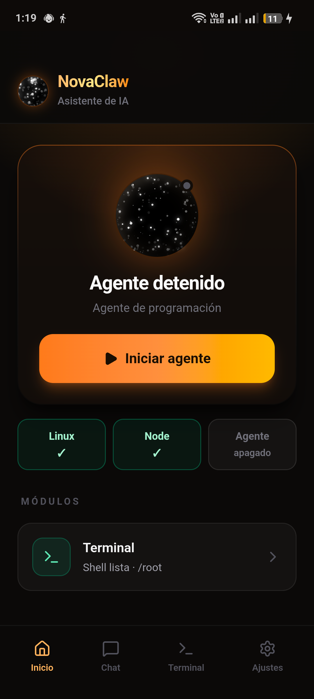
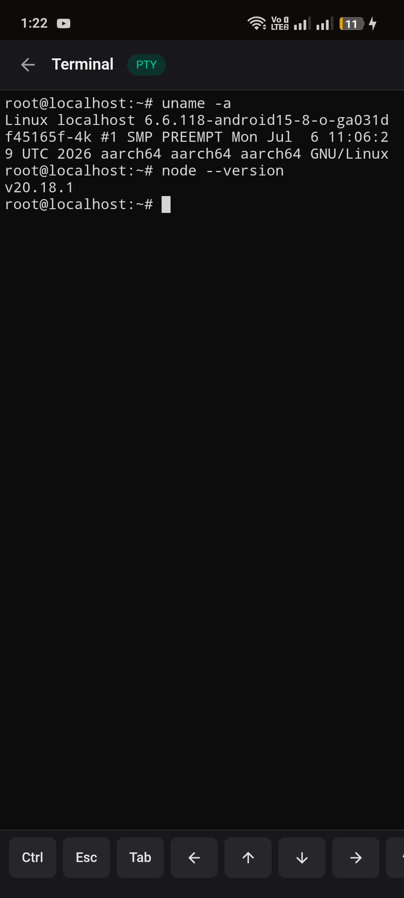

# NovaClaw

**A full coding & phone agent that runs entirely on your Android phone** — the
phone-native equivalent of Claude Code / Codex. NovaClaw ships an embedded Linux
(Termux bootstrap) + Node.js inside the APK, and runs its own agent there: it can
run shell commands, read/edit files, browse your storage, see images, and use
phone capabilities (camera, GPS, contacts, calendar) — all on-device, BYOK.

<p align="center">
  
</p>

<p align="center">
  <em>Real footage on an OPPO CPH2557 (Android 15): the agent writes a file,
  verifies it with <code>node --check</code> and runs it — all inside the
  phone's embedded Linux. Full clip:
  <a href="docs/media/novaclaw-demo.mp4">novaclaw-demo.mp4</a> (57 s).</em>
</p>

<p align="center">
  
  &nbsp;&nbsp;
  
</p>

<p align="center">
  <em>Left: the app's home screen. Right: the built-in PTY terminal — that's a
  real Linux kernel (<code>aarch64 GNU/Linux</code>) and Node 20 running on the
  phone, not a remote shell.</em>
</p>

> **Status: v0.1.0 — early. Tested by one person, on one phone.** It works and
> the APK is signed, but the only hardware it has ever run on is a single OPPO
> CPH2557 (Android 15, arm64), tested by the author. Nobody else has used it
> yet, so expect rough edges on other devices — and please open an issue when
> you hit one. Installable by sideload — not on Google Play. Ships at
> `targetSdk 34`, running the embedded Linux under **proot** (bundled as a
> native lib) so it executes binaries without root and without depending on the
> old `targetSdk 28` trick. See [docs/PROOT_TARGETSDK.md](docs/PROOT_TARGETSDK.md).
> A legacy `targetSdk 28` build (direct exec) is still available as a fallback.

**Install:** see [docs/INSTALL.md](docs/INSTALL.md) (non-technical guide).

---

## What it does

- **On-device agent** with NATIVE function-calling (like Claude Code/Codex):
  explore → surgical edit → verify. Extended/interleaved thinking for Claude
  models. Streams each step live (SSE); gives **one consolidated final answer**
  instead of chatty intermediate messages.
- **Tools:** `terminal_run`, `file_read` (line-numbered, ranged), `file_edit`
  (surgical old→new), `file_write`, `file_grep`, `file_list`, `file_search`,
  `workspace_mkdir`, `web_fetch`, `image_view` (vision), `subagent_run`,
  `todo_write` (live task plan), and phone tools: `phone_location`,
  `phone_contacts`, `phone_calendar`, `phone_photo` (takes a picture **and**
  sees it).
- **Phone connectors:** enable Files / Camera / Location / Contacts / Calendar
  from Settings; each maps to a real Android permission.
- **Real PTY terminal** over WebSocket (`vim`, `htop`, `tail -f` work).
- **Multi-conversation history**, rewind/edit, stop button, project memory
  (`NOVACLAW.md` injected into the system prompt, like `CLAUDE.md`).
- **BYOK (bring your own key):** the user provides their own model API key
  (OpenRouter, Zen, NVIDIA, Anthropic, OpenAI). **No key is ever embedded** in
  the binary.

## Architecture

```
┌───────────────────────────────────────────────────────────────┐
│  APK (android-native/, targetSdk 34, arm64)                   │
│                                                               │
│  MainActivity ─ loads WebView → http://127.0.0.1:8088         │
│  NovaClawService (foreground) ─ owns the Node agent process   │
│  RuntimeManager ─ installs Termux bootstrap + Node, runs agent│
│  NativeToolsServer (127.0.0.1:8099) ─ camera/GPS/contacts/cal │
│  ConnectorBridge ─ window.NovaClawNative (permissions)        │
│  TokenStore ─ per-install secret shared with the agent        │
├───────────────────────────────────────────────────────────────┤
│  Agent (Node, bundled to agent.cjs, runs inside embedded Linux)│
│    server.ts ─ Express on 127.0.0.1:8088 (token-gated) + PTY  │
│    src/agent/nativeAgent.ts ─ agent loop (native tool-calling)│
│    src/agent/modelClient.ts ─ OpenAI + Anthropic client       │
│    src/agent/tools.ts ─ tool executor                         │
│    src/agent/safety.ts ─ approval policy                      │
├───────────────────────────────────────────────────────────────┤
│  Frontend (React) ─ served by the agent; platform.ts fetches │
│    /api with the injected token (X-Nova-Token)                │
└───────────────────────────────────────────────────────────────┘
```

The React UI, the agent, and the tools are portable TypeScript. On the phone the
UI runs in a WebView and talks to the local agent over HTTP; a browser/PC dev
mode (`npm run dev`) runs the same agent behind Express.

## Security model

The agent can run arbitrary code and touch the phone, so it is locked down:

- **Loopback only.** The agent (`127.0.0.1:8088`) and the native tools server
  (`127.0.0.1:8099`) bind to loopback — never to the network. No device on your
  Wi-Fi can reach them.
- **Token auth.** A random per-install token (`TokenStore`) is required on every
  `/api/*` call, on the `/pty` WebSocket, and on the native tools server. The
  agent injects it into the served HTML; other apps on the phone don't have it.
- **Approval gate** (`src/agent/safety.ts`): **every shell command requires
  explicit approval.** There is no unattended path. An earlier allowlist model
  was bypassable in two steps — the agent writes a script with `file_write`
  (no approval needed) and runs it with an allowlisted `node` — and even genuine
  read-only binaries leak secrets (`printenv ZEN_API_KEY`,
  `cat /proc/self/environ`). While the agent runs through an inherited shell we
  can't really tell the difference, so we don't pretend to. The command analysis
  is kept to *explain* the risk in the approval dialog, never to skip it.
  Installing an MCP server (`mcp.add`) is code execution through another door and
  goes through the same gate. Writes outside the workspace or to critical files
  also require approval.
- **Secrets never reach child processes.** The user's API key and the app↔agent
  token live in the agent's own environment, but every process the agent spawns —
  shell commands, the PTY, `PostToolUse` hooks, MCP servers, LSP installs — gets
  a sanitized copy with credentials stripped (`src/agent/childEnv.ts`). Approving
  one command cannot cost you your key. A test walks the source tree and fails
  the build if any new spawn point inherits the raw environment.
- **Secret protection.** `file_read`/`file_grep` refuse to read files holding
  secrets (`novaclaw.config.json`, `*.jks`, …). `web_fetch` blocks loopback and
  private IP ranges (SSRF protection).
- **App hardening.** `allowBackup=false`, cleartext restricted to loopback
  (network security config), WebView with no file/content access and external
  links opened in the system browser. Release builds are non-debuggable.

## Build

```bash
# Web/PC dev (same agent behind Express)
npm install
npm run dev            # http://localhost:3000
npm test               # tsc-checked test suites

# Android APK (Windows / PowerShell)
python scripts/fetch_proot_so.py                      # once: populate jniLibs with proot
pwsh scripts/build-android.ps1 -Arch arm64            # debug
pwsh scripts/build-android.ps1 -Arch arm64 -Release   # signed release
# output: android-native/app/build/outputs/apk/arm64/<debug|release>/
```

CI builds the release APK on every `vX.Y.Z` tag and attaches it to the GitHub
Release — see [.github/workflows/release.yml](.github/workflows/release.yml).

Release signing uses `android-native/keystore.properties` +
`novaclaw-release.jks` (both outside git). **Keep the keystore safe** — every
update must be signed with the same key.

## Install (sideload)

1. Download the APK from Releases (or build it).
2. Enable "install from unknown sources" on the phone.
3. Install. First launch downloads the base system once (~300 MB: Linux + Node).
4. Open Settings → AI Model and paste your own API key (BYOK).

Requires Android 8+ arm64.

## License

NovaClaw's own source is **MIT** (see [LICENSE](LICENSE)). The distributed APK
bundles third-party binaries (proot under GPLv2, the Termux bootstrap, Shizuku)
under their own licenses — see [THIRD-PARTY-LICENSES.md](THIRD-PARTY-LICENSES.md)
for the details and the GPL obligations that apply when you redistribute the APK.

For the distribution plan (open-source + niche strategy), see
[docs/DISTRIBUCION.md](docs/DISTRIBUCION.md).
